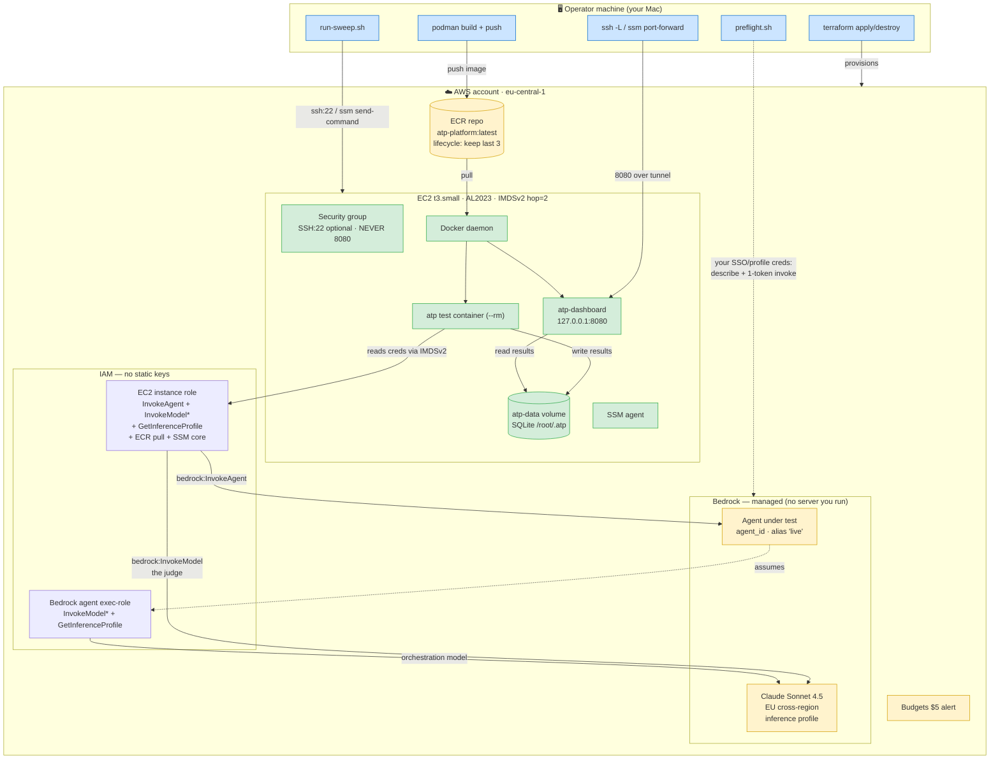
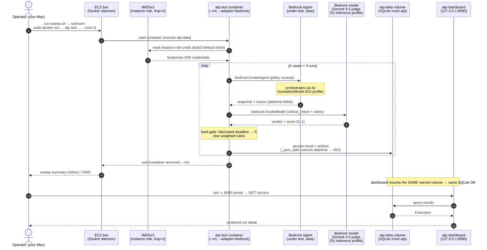

# ATP all-in-AWS demo — Infrastructure as Code

Codifies the "everything in AWS via IAM" demo: a **Bedrock Agent stub** (the agent
under test) and **Claude Sonnet 4.5 as judge**, both authenticating through the
EC2 **instance role** — no API keys, no static AWS credentials. Region
`eu-central-1`; Sonnet 4.5 reached via the **EU cross-region inference profile**.

This is the **canonical** AWS path (it replaced the earlier manual
`examples/aws-cloud/` runbook): one `terraform apply` / `destroy`, a prebuilt
image pulled from **ECR** (no fragile on-box build), a **$5 budget alert**, and a
**preflight** that catches the expensive failure modes for free.

## What it creates

| Resource | File | Note |
|---|---|---|
| Bedrock Agent stub + alias `live` | `terraform/bedrock_agent.tf` | trivial single-prompt agent; role name forced to `AmazonBedrockExecutionRoleForAgents_*` |
| EC2 instance role + profile | `terraform/iam.tf` | InvokeAgent (alias) + InvokeModel* (profile + all EU dest FMs) + ECR pull; no `Resource:"*"` on Bedrock |
| ECR repo (+ lifecycle) | `terraform/ecr.tf` | keeps last 3 images |
| EC2 (AL2023, IMDSv2 hop=2) + SG | `terraform/ec2.tf` | **only SSH open, never 8080** |
| $5 monthly budget alert | `terraform/budget.tf` | alert only — not a hard cap |

## Architecture

Source + interactive HTML: [`docs/architecture.md`](docs/architecture.md) ·
[`docs/architecture.html`](docs/architecture.html) (open in a browser; pan/zoom).

### Resource & IAM map



### Single-run sequence



## Manual prerequisites (cannot be Terraformed)

1. **Enable Bedrock model access** for Claude Sonnet 4.5 in **eu-central-1**
   (Bedrock console → Model access). Accepting the model EULA is account-level and
   has no reliable TF resource. Without it everything 403s. `preflight.sh` step [1]
   detects this.
2. **Access mode** (see "SSH vs SSM" below):
   - **SSH (default):** an **EC2 key pair** in the region + `ssh_ingress_cidr`.
   - **SSM-only** (`enable_ssh=false`): nothing — no key pair, no open port; the
     instance role already carries `AmazonSSMManagedInstanceCore`. You need the
     **Session Manager plugin** for the AWS CLI on the operator machine.
3. Operator AWS creds (SSO/profile) that can `terraform apply`, push to ECR, and
   (for preflight) describe Bedrock.

## Order of operations

```bash
cd terraform
cp terraform.tfvars.example terraform.tfvars   # set key_pair_name, ssh_ingress_cidr=YOUR_IP/32, budget_email
terraform init
terraform apply                                # ECR -> build+push image -> IAM, agent, EC2, budget
                                               #   (apply builds & pushes the image BEFORE the box boots;
                                               #    needs docker + AWS creds locally. build_push_on_apply=false to skip)

cd ..
./scripts/preflight.sh                         # free checks; add --invoke for a ~1-token paid check
./scripts/run-sweep.sh ~/.ssh/my-key.pem 3     # sweep on the box via IAM role; RUNS=3

# dashboard (never exposed publicly):
ssh -i ~/.ssh/my-key.pem -L 8080:localhost:8080 ec2-user@<instance_public_dns>
#   -> http://localhost:8080/ui/

terraform destroy                              # tear everything down when done
```

> **Image ordering (no race by default):** `terraform apply` builds & pushes the
> image to ECR via `terraform_data.image_push` *before* creating the instance, so
> the box never boots to an empty registry.
>
> **After you change project CODE**, a plain `terraform apply` will **not** rebuild
> — Terraform can't see source edits; the build re-triggers only when `image_tag`,
> the ECR URL, or **`source_version`** changes. So either:
> - `terraform apply -var source_version=$(git -C .. rev-parse --short HEAD)` (rebuild via TF), or
> - `./scripts/build-and-push.sh` (rebuild out of band).
>
> Both only update the **registry**. They do **not** touch an already-running
> instance — to run the new image, re-pull + restart on the box
> (`docker pull … && docker restart atp-dashboard` — the push script prints the
> exact line) or recreate it (`terraform taint aws_instance.atp && terraform apply`).
> `run-sweep.sh` does its own `docker run`, so the sweep always uses whatever image
> is present on the box.
>
> **CI / repeatable pipelines:** the in-`apply` Docker build couples `terraform apply`
> to a local Docker daemon + ECR auth + build time. For CI, set
> `build_push_on_apply=false` and build/push an **immutable** tag (e.g. the git SHA)
> from a separate Make target or GitHub Action, then `terraform apply -var image_tag=<sha>`
> — Terraform just consumes the existing tag.
>
> With `build_push_on_apply=false` and no out-of-band push, the instance boots to an
> empty registry (user-data retries cover only a short gap).

## SSH vs SSM access

The dashboard is **never** exposed publicly — you always reach it over a tunnel.
Two ways in:

**SSH (default, `enable_ssh = true`):** opens port 22 to `ssh_ingress_cidr` only,
attaches `key_pair_name`. Tunnel + sweep as in the steps above:

```bash
ssh -i ~/.ssh/my-key.pem -L 8080:localhost:8080 ec2-user@<instance_public_dns>
./scripts/run-sweep.sh ~/.ssh/my-key.pem 3
```

**SSM-only (`enable_ssh = false`):** **zero inbound ports, no key pair.** Shell and
port-forward go through Session Manager (instance role already has
`AmazonSSMManagedInstanceCore`; install the AWS CLI Session Manager plugin). The
scripts speak SSM directly:

```bash
./scripts/run-sweep.sh --ssm 3        # send-command + poll; no key, no open port

# dashboard port-forward (replaces the SSH tunnel):
aws ssm start-session --target <instance_id> \
  --document-name AWS-StartPortForwardingSession \
  --parameters '{"portNumber":["8080"],"localPortNumber":["8080"]}'
#   -> http://localhost:8080/ui/
```

`run-sweep.sh --ssm` runs the sweep via `aws ssm send-command` and polls to
completion. SSM truncates inline stdout, so the full per-test results live in the
dashboard (the run is stored in the `atp-data` volume either way).
`<instance_id>` is a Terraform output.

## Why these choices (vs the earlier manual runbook)

- **Pull from ECR, not build on the box** — kills the OOM/slow-build risk on a
  small instance and the GitHub-vs-GitLab sync risk (no `git clone` in user-data).
- **EU inference profile, not bare `foundation-model`** — Sonnet 4.5 in EU is not
  on-demand; the IAM policy is scoped to the profile ARN **and** the foundation
  model in every destination region (`variables.tf:model_destination_regions`),
  the actual fix for the `AccessDenied`/`ValidationException` you'd otherwise hit.
- **Agent + alias in TF** — automates the heaviest manual precondition and feeds
  `agent_id`/`alias_id` straight into the run/preflight scripts (one source of truth).
- **method/cases live in the image** (Dockerfile `COPY .`), so no host mount.

## Cost / safety

- Every agent and judge call is a billed Bedrock invocation. **`method/cases/req-extraction`
  is a 4-case sweep** (clean / moderate / severe / very-severe), and each case is
  one agent call **plus** one judge call. So `RUNS=N` ≈ **4 × N agent + 4 × N judge**
  Bedrock invocations — e.g. the `RUNS=3` default is ~24 calls, not 3. Tokens per
  call are tiny, but keep `RUNS` single-digit for the $5 ceiling.
- The budget is an **alert, not a stop**. The real cost control is small `--runs`
  plus `terraform destroy` (and stopping the EC2 instance) promptly.
- EC2 + EBS accrue while running even with zero Bedrock calls — destroy after the demo.

## Verify before you trust it

This IaC has **not** been `terraform apply`'d from here — review `terraform plan`
and adjust the inference-profile id / destination-region list against your account
(`aws bedrock list-inference-profiles --region eu-central-1`) before applying.
