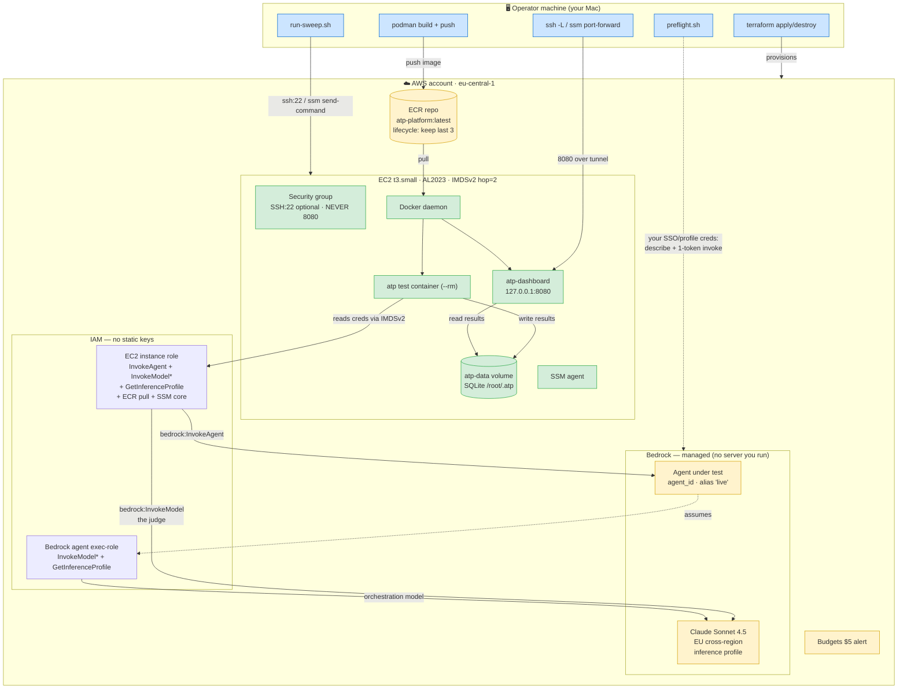
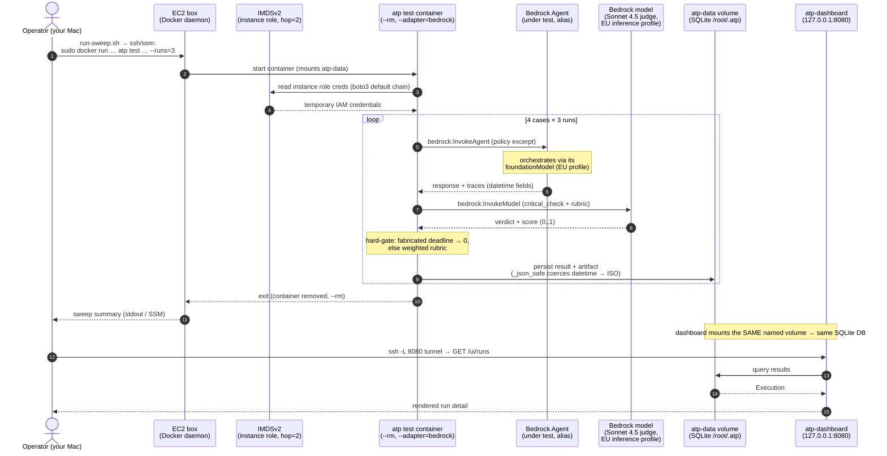

# ATP all-in-AWS Bedrock demo — architecture

Two views of the `infra/` Terraform demo: a resource/IAM map (where processes
run) and the request flow of a single methodology sweep.

## Resource & IAM map

## Single-run sequence

